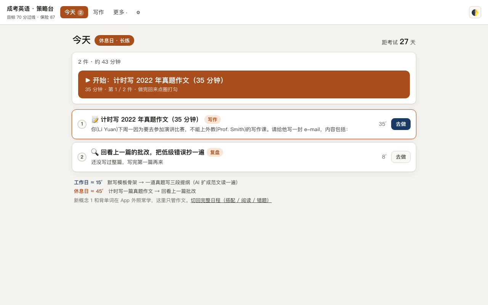
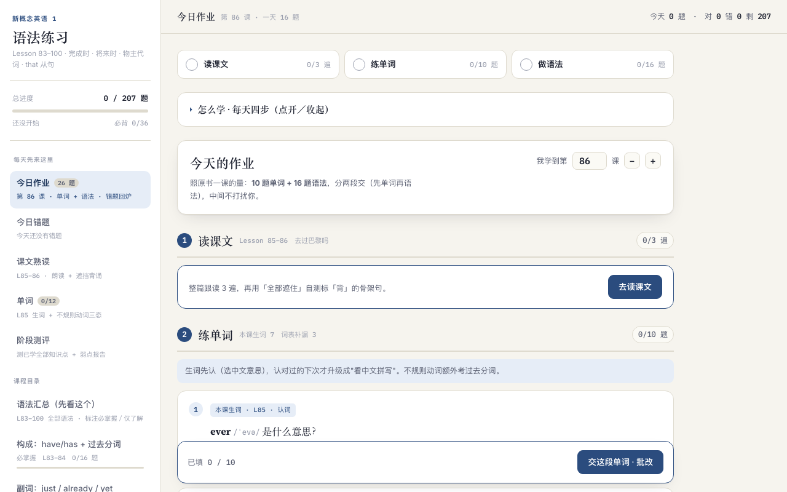
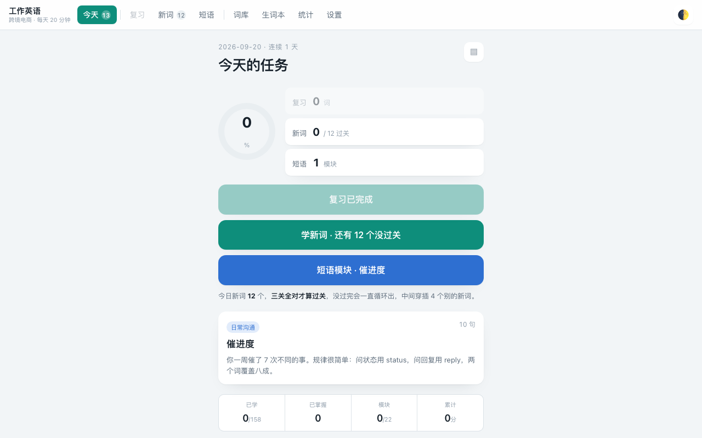

# 学习类 App 合集 · Study Apps

**离线可用、零构建的自学网页 App：成考专升本英语 / 政治 / 高数二 AI 私教、新概念 1 语法练习、工作英语，自带间隔复习与硬盘进度备份。**

中文 | [English](README.en.md)

 
 

几个跑在自己电脑上的网页版学习 App。共同特点：

- **纯 HTML / CSS / 原生 JS**，没有构建步骤，双击启动脚本就能用；
- **离线可用**，只有 AI 讲题 / 批改 / 诊断需要联网 + 自己填一个 API Key（Key 只存本地浏览器）；
- **进度不丢**：用 `server.py` 起一个本地小服务器，网页每次提交都把进度 POST 回硬盘 `backups/`（仓库里不含个人进度）；
- **间隔复习**：错题按 SRS / FSRS 排期，「先复习再学新」。

| 目录 | 备考 / 目标 | 亮点 | 端口 |
|---|---|---|---|
| [`chengkao-english/`](chengkao-english/) | 成考专升本英语，满分 150，目标 90+（考试 2026-10-17） | 两套界面共用题库：**应试策略台**（板块记分牌、固定答题顺序、错题必须归因、只学 7 大语法考点）与老版 28 章私教；70 个知识框架层把解析图形化；写作模板描红底影，写多了自然脱稿 | 8899 |
| [`chengkao-politics/`](chengkao-politics/) | 成考专升本政治，目标 90+ | 先摸底出诊断报告，自动生成三阶段计划；真题 2018–2025 分年题库 + 时政 | 8000 |
| [`chengkao-math/`](chengkao-math/) | 成考专升本高等数学（二），零基础起步，目标 60+ | 本地 KaTeX 渲染公式；摸底定位起点（零基础启蒙 / 预备 / 基础 / 冲刺）；核心必考章优先的最省时路线；双写存档防清空 | 8011 |
| [`nce1-grammar/`](nce1-grammar/) | 新概念英语 1 语法（对照剑桥语法体系） | 全册语法速查手册 + 分课练习；今日错题视图；每次提交自动备份 | 8902 |
| [`work-english/`](work-english/) | 跨境电商 / TikTok 投放场景工作英语，每天 20 分钟 | 词句全部来自真实飞书沟通；FSRS 遗忘曲线排复习队列；「顽固 / 偶尔错 / 干净」三档 | 见 `说明.md` |

## 给谁用

| 你是 | 用哪个 |
|---|---|
| **备考成人高考专升本**（英语 / 政治 / 高数二）的在职考生，基础薄弱、每天只有半小时 | [`chengkao-english/`](chengkao-english/) · [`chengkao-politics/`](chengkao-politics/) · [`chengkao-math/`](chengkao-math/) |
| **从新概念 1 重学英语语法**的成人 | [`nce1-grammar/`](nce1-grammar/) |
| **做跨境电商 / TikTok 投放**，需要每天练一点工作英语的人 | [`work-english/`](work-english/) |
| 想抄一套「纯前端 + 本地备份 + SRS 复习」学习 App 骨架的开发者 | 任意一个目录的 `server.py` + `js/storage.js` + `js/srs.js` |

关键词：成考 · 专升本 · 英语 · 政治 · 高等数学 · 新概念英语 · AI 私教 · 间隔重复 · FSRS · 离线 · 纯 HTML

## 怎么打开

每个目录里都有一个 `启动XX.command`（Mac 双击）——它找到 python3、跑 `server.py`、自动开浏览器。
第一次可能提示「无法验证开发者」：右键 → 打开 → 再点打开，只需一次。

> 不要直接双击 `index.html`：`file://` 与 `localhost` 是两套存储，浏览器清缓存时容易把进度清掉。端口是钉死的，别改，改了进度就对不上。

## AI 接口

设置里填一次 API Key 即可。默认走 Anthropic 原生 `/v1/messages` 格式，日常模型 `claude-haiku-4-5`、批改 / 诊断用 `claude-sonnet-5`；接口地址可换成任意兼容中转。

## 改题库 / 加课

题库都是 `js/questions-*.js` 之类的纯数据文件。改完 `node --check js/*.js` 过一遍语法；`index.html` 里引用的脚本带 `?v=N`，改动后把 N 加一才能绕过浏览器缓存。各目录的 `README.md` / `HANDOFF.md` 写了每个 App 自己的数据结构与踩过的坑。

## 同步

源码在桌面各目录里改，运行 `sync-from-desktop.sh` 会把最新版拷进来（排除 backups / 进度存档 / .DS_Store），再提交推送。

## 联系

- 微信：**Anyway77777777**
- GitHub：[@njh20030605-code](https://github.com/njh20030605-code)

## 许可

MIT，见 [LICENSE](LICENSE)。
